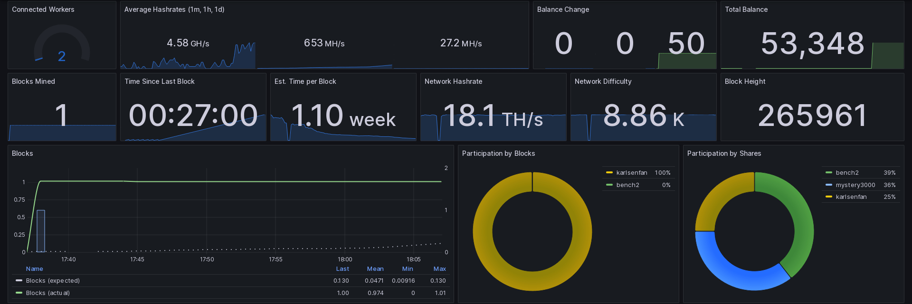
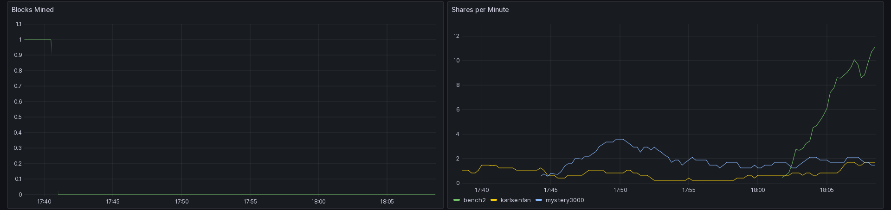
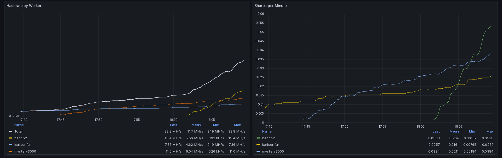
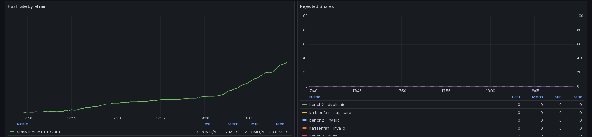

# Pugdag Stratum Adapter

This is a lightweight daemon that allows mining to a local (or remote)
Pugdag node using stratum-base miners.

This daemon is confirmed working with the miners below in both dual-mining
and Pugdag-only modes (for those that support it) and Windows, Linux,
macOS and HiveOS.

- [srbminer](https://github.com/doktor83/SRBMiner-Multi/releases)

Discord discussions/issues: [here](https://discord.gg/pPNESjGfb5)

Huge shoutout to https://github.com/KaffinPX/KStratum and
https://github.com/GRinvestPOOL/pugdag-stratum-bridge and
https://github.com/rdugan/kaspa-stratum-bridge for the inspiration.

Tips appreciated: `pugdag:qqe3p64wpjf5y27kxppxrgks298ge6lhu6ws7ndx4tswzj7c84qkjlrspcuxw`

## Hive Setup

[detailed instructions here](docs/hive-setup.md)

# Features

Shares-based work allocation with miner-like periodic stat output:

```
===============================================================================
  worker name   |  avg hashrate  |   acc/stl/inv  |    blocks    |    uptime
-------------------------------------------------------------------------------
 3060ti         |       0.13GH/s |          3/0/0 |            0 |       6m48s
-------------------------------------------------------------------------------
                |       0.13GH/s |          3/0/0 |            0 |       7m20s
========================================================= pug_bridge_v1.0.0 ===
```

## Grafana UI

The grafana monitoring UI is an optional component but included for
convenience. It will help to visualize collected statistics.

[detailed instructions here](docs/monitoring-setup.md)









Many of the stats on the graph are averaged over a configurable time
period (24hr default - use the 'resolution' dropdown to change this), so
keep in mind that the metrics might be incomplete during this initial
period.

## Prometheus API

If the app is run with the `-prom={port}` flag the application will host
stats on the port specified by `{port}`, these stats are documented in
the file [prom.go](src/pugdagstratum/prom.go). This is intended to be use
by prometheus but the stats can be fetched and used independepugy if
desired. `curl http://localhost:2114/metrics | grep pug_` will get a
listing of current stats. All published stats have a `pug_` prefix for
ease of use.

```
user:~$ curl http://localhost:2114/metrics | grep pug_
# HELP pug_estimated_network_hashrate_gauge Gauge representing the estimated network hashrate
# TYPE pug_estimated_network_hashrate_gauge gauge
pug_estimated_network_hashrate_gauge 2.43428982879776e+14
# HELP pug_network_block_count Gauge representing the network block count
# TYPE pug_network_block_count gauge
pug_network_block_count 271966
# HELP pug_network_difficulty_gauge Gauge representing the network difficulty
# TYPE pug_network_difficulty_gauge gauge
pug_network_difficulty_gauge 1.2526479386202519e+14
# HELP pug_valid_share_counter Number of shares found by worker over time
# TYPE pug_valid_share_counter counter
pug_valid_share_counter{ip="192.168.0.17",miner="SRBMiner-MULTI/2.4.1",wallet="pugdag:qzk3uh2twkhu0fmuq50mdy3r2yzuwqvstq745hxs7tet25hfd4egcafcdmpdl",worker="002"} 276
pug_valid_share_counter{ip="192.168.0.24",miner="SRBMiner-MULTI/2.4.1",wallet="pugdag:qzk3uh2twkhu0fmuq50mdy3r2yzuwqvstq745hxs7tet25hfd4egcafcdmpdl",worker="003"} 43
pug_valid_share_counter{ip="192.168.0.65",miner="SRBMiner-MULTI/2.4.1",wallet="pugdag:qzk3uh2twkhu0fmuq50mdy3r2yzuwqvstq745hxs7tet25hfd4egcafcdmpdl",worker="001"} 307
# HELP pug_worker_job_counter Number of jobs sent to the miner by worker over time
# TYPE pug_worker_job_counter counter
pug_worker_job_counter{ip="192.168.0.17",miner="SRBMiner-MULTI/2.4.1",wallet="pugdag:qzk3uh2twkhu0fmuq50mdy3r2yzuwqvstq745hxs7tet25hfd4egcafcdmpdl",worker="002"} 3471
pug_worker_job_counter{ip="192.168.0.24",miner="SRBMiner-MULTI/2.4.1",wallet="pugdag:qzk3uh2twkhu0fmuq50mdy3r2yzuwqvstq745hxs7tet25hfd4egcafcdmpdl",worker="003"} 3399
pug_worker_job_counter{ip="192.168.0.65",miner="SRBMiner-MULTI/2.4.1",wallet="pugdag:qzk3uh2twkhu0fmuq50mdy3r2yzuwqvstq745hxs7tet25hfd4egcafcdmpdl",worker="001"} 3425
```

# Install

## Build from source (native executable)

Install go 1.18 using whatever package manager is appropriate for your
system.

```
cd cmd/pugdagbridge
go build .
```

Modify the config file in `./cmd/pugdagbridge/config.yaml` with your setup,
the file comments explain the various flags.

```
./pugdagbridge
```

To recap the entire process of initiating the compilation and launching
the pugdag dridge, follow these steps:

```
cd cmd/pugdagbridge
go build .
./pugdagbridge
```

## Docker (all-in-one)

Best option for users who want access to reporting, and aren't already
using Grafana/Prometheus. Requires a local copy of this repository, and
docker installation.

[Install Docker](https://docs.docker.com/engine/install/) using the
appropriate method for your OS. The docker commands below are assuming a
server type installation - details may be different for a desktop
installation.

The following will run the bridge assuming a local pugdagd node with
default port settings, and listen on port 5555 for incoming stratum
connections.

```
git clone https://github.com/GRinvestPOOL/pugdag-stratum-bridge.git
cd pugdag-stratum-bridge
docker compose -f docker-compose-all-src.yml up -d --build
```

These settings can be updated in the [config.yaml](cmd/pugdagbridge/config.yaml)
file, or overridden by modifying, adding or deleting the parameters in the
`command` section of the `docker-compose-all-src.yml` file. Additionally,
Prometheus (the stats database) and Grafana (the dashboard) will be
started and accessible on ports 9090 and 3000 respectively. Once all
services are running, the dashboard should be reachable at
`http://127.0.0.1:3000/d/x7cE7G74k1/pugb-monitoring` with default
username and password `admin`.

These commands builds the bridge component from source, rather than
the previous behavior of pulling down a pre-built image. You may still
use the pre-built image by replacing `docker-compose-all-src.yml` with
`docker-compose-all.yml`, but it is not guaranteed to be up to date, so
compiling from source is the better alternative.

## Docker (bridge only)

Best option for users who want docker encapsulation, and don't need
reporting, or are already using Grafana/Prometheus. Requires a local
copy of this repository, and docker installation.

[Install Docker](https://docs.docker.com/engine/install/) using the
appropriate method for your OS. The docker commands below are assuming a
server type installation - details may be different for a desktop
installation.

The following will run the bridge assuming a local pugdagd node with
default port settings, and listen on port 5555 for incoming stratum
connections.

```
git clone https://github.com/GRinvestPOOL/pugdag-stratum-bridge.git
cd pugdag-stratum-bridge
docker compose -f docker-compose-bridge-src.yml up -d --build
```

These settings can be updated in the [config.yaml](cmd/pugdagbridge/config.yaml)
file, or overridden by modifying, adding or deleting the parameters in the
`command` section of the `docker-compose-bridge-src.yml`

These commands builds the bridge component from source, rather than the
previous behavior of pulling down a pre-built image. You may still use
the pre-built image by issuing the command `docker run -p 5555:5555 pugdagnetwork/pugdag_bridge:latest`,
but it is not guaranteed to be up to date, so compiling from source is
the better alternative.
